# Flowcharts — Automated Wall Painting Machine

## Main Program Flow

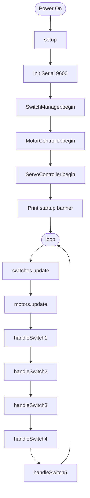

## Switch Debounce Flow

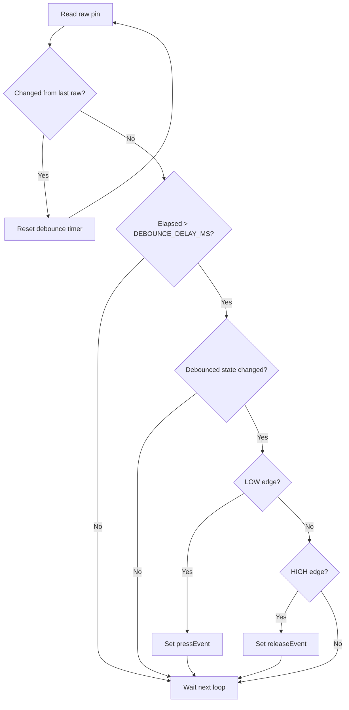

## SW1 — Wheel Forward (Held)

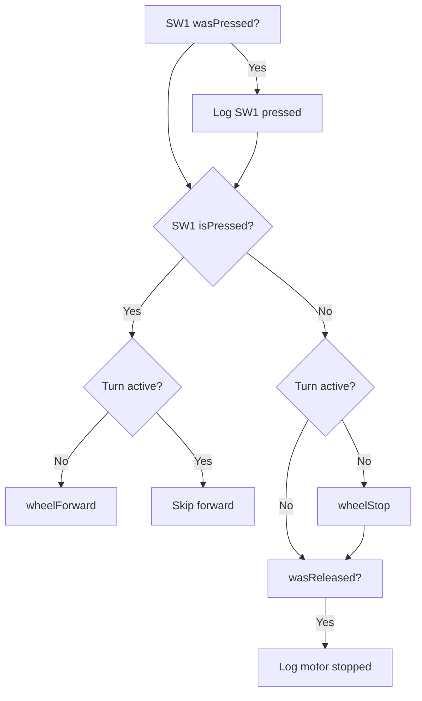

## SW2 — Servo1 Ceiling Position

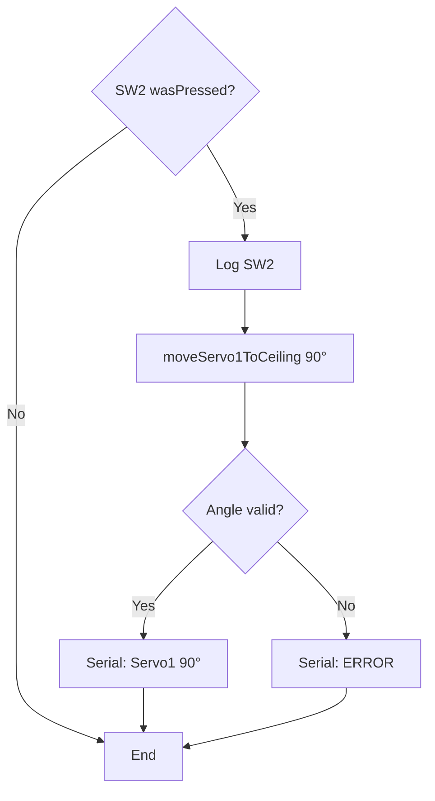

## SW3 — Servo2 Cycle

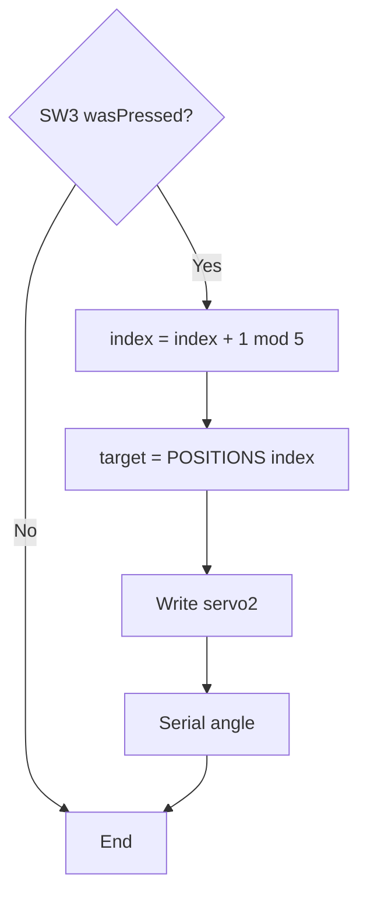

Positions: **0 → 45 → 90 → 135 → 180 → 0**

## SW4 — Right Turn

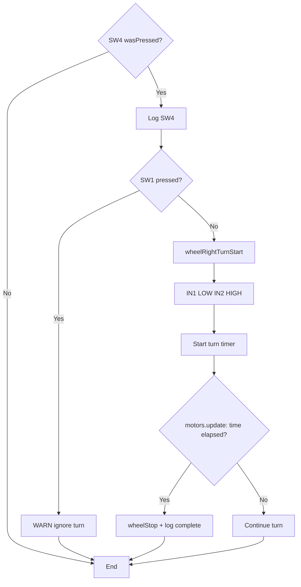

## SW5 — Drum Wrap / Release

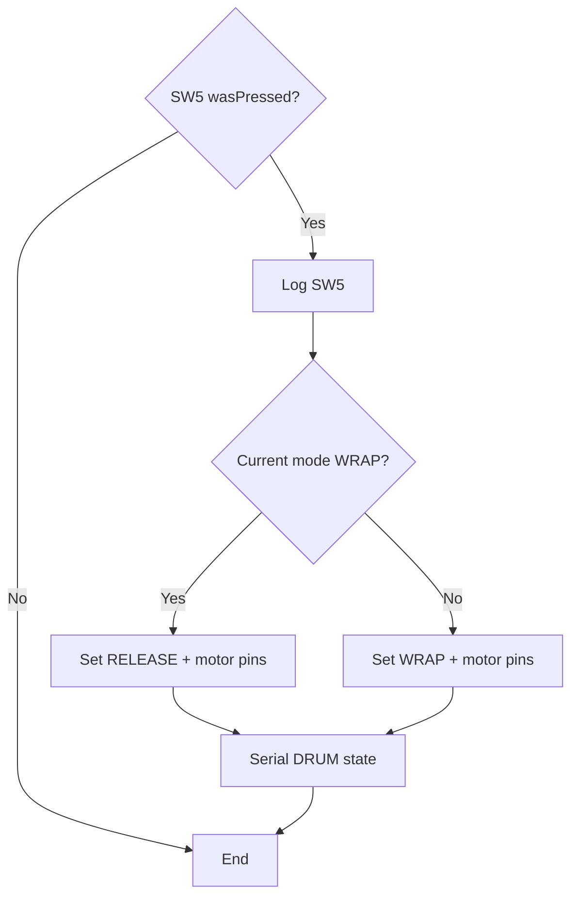

## Motor Timeout Safety

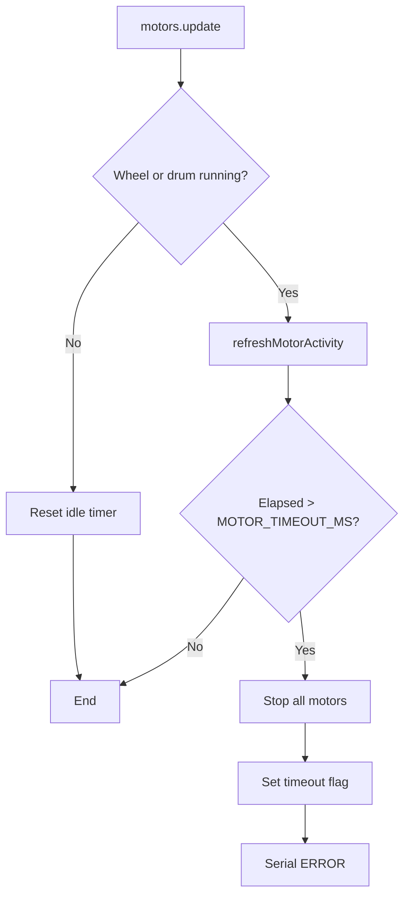

## SW6 — Pump (External to Firmware)

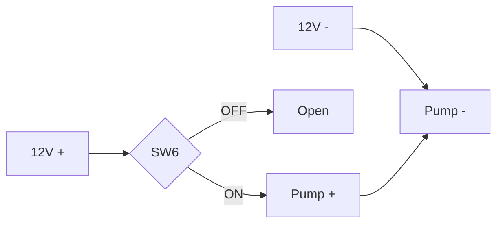

## System Data Flow

```
Operator → SW1..SW5 → SwitchManager → main.ino handlers
                              ↓
                    MotorController / ServoController
                              ↓
                    H-bridge / Servo signals → Mechanics

Operator → SW6 → 12V → Pump (parallel path, no MCU)
```

## State Machine Diagram (Drum)

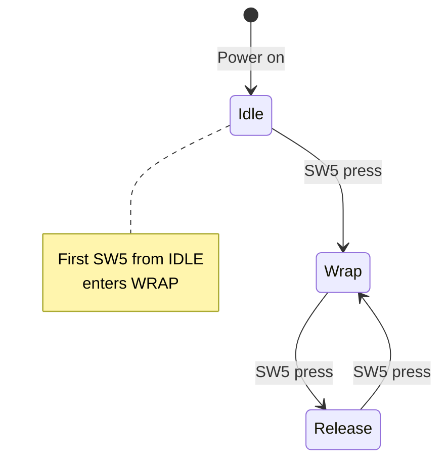

## State Machine Diagram (Servo2 Index)

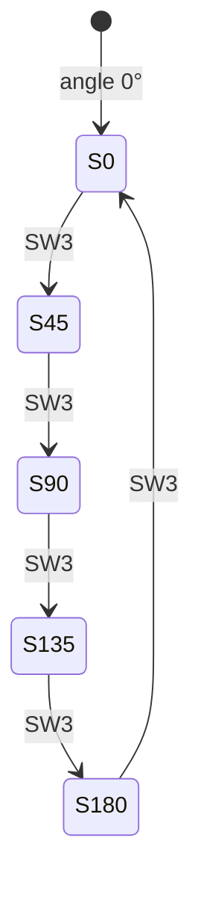
