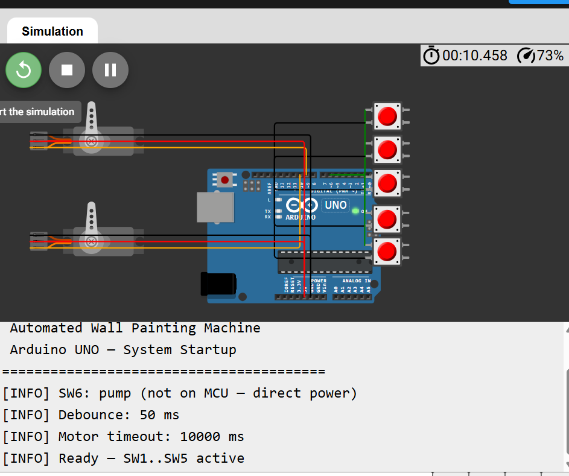
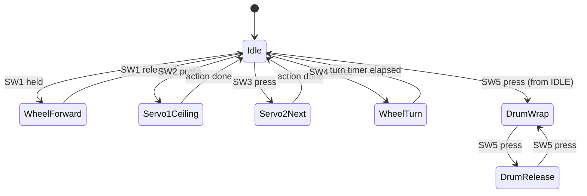

# Automated Wall Painting Machine

switch-controlled automated wall and ceiling painting system based on Arduino UNO.

## Overview

The machine paints walls and ceilings using a roller fed by a paint pump. A wheel motor drives the chassis against the wall; a drum motor raises and lowers the roller table via cable; two servos adjust roller orientation for ceiling work and hidden wall sections. Six switches control operation; **SW6 is not connected to the Arduino** — it switches the paint pump directly from the 12 V supply.

### Main Components

| Component | Role |
|-----------|------|
| Arduino UNO (ATmega328P) | Central controller |
| Wheel DC motor | Drive / turn |
| Drum DC motor | Vertical roller table (cable wrap/release) |
| Servo 1 | Ceiling painting roller position (90°) |
| Servo 2 | Roller angle cycle (0°–180°) |
| Paint pump | Paint delivery (SW6 only) |
| 12 V Li-ion battery | System power |
| Switches SW1–SW6 | Operator control |

## Simulation (Tinkercad)

Bench setup with Arduino UNO, two servos (D9, D10), and switches SW1–SW5 (D2–D6). Serial Monitor at **9600 baud** shows the startup banner when the sketch runs.



## Software Architecture

```
main.ino
    ├── SwitchManager   (debounce, press/release edges)
    ├── MotorController (wheel + drum, timeout, turn sequence)
    └── ServoController (Servo.h — angle limits, SW2/SW3 actions)

include/Config.h        (pins, timings, constants)
```

### Module Responsibilities

| Module | File(s) | Function |
|--------|---------|----------|
| **Config** | `include/Config.h` | Pin map, debounce interval, motor timeout, servo angles |
| **SwitchManager** | `src/SwitchManager.*` | INPUT_PULLUP reads, 50 ms debounce, one-shot `wasPressed()` |
| **MotorController** | `src/MotorController.*` | H-bridge outputs, forward/stop/turn, drum wrap/release toggle |
| **ServoController** | `src/ServoController.*` | Servo1 → 90°; Servo2 cycles 0/45/90/135/180° |
| **main** | `main.ino` | `setup()` / `loop()`, switch-to-action mapping, Serial logging |

### State Machine (Simplified)



Pump (SW6) is **outside** this state machine — direct power path only.

## Pin Mapping

| Signal | Arduino Pin | Notes |
|--------|---------------|-------|
| SW1 | D2 | Wheel forward (held) |
| SW2 | D3 | Servo1 → 90° |
| SW3 | D4 | Servo2 angle cycle |
| SW4 | D5 | Right turn |
| SW5 | D6 | Drum wrap/release toggle |
| SW6 | — | **Not on Arduino** — pump ↔ 12 V |
| Servo1 | D9 | PWM capable |
| Servo2 | D10 | PWM capable |
| Wheel IN1 | D7 | Motor driver |
| Wheel IN2 | D8 | Motor driver |
| Drum IN1 | D11 | Motor driver |
| Drum IN2 | D12 | Motor driver |

All SW1–SW5 use `INPUT_PULLUP` (pressed = LOW).

## Switch Functions

| Switch | Behavior |
|--------|----------|
| **SW1** | Wheel motor forward while pressed |
| **SW2** | Servo1 moves to exactly 90° |
| **SW3** | Servo2 advances: 0° → 45° → 90° → 135° → 180° → 0°… |
| **SW4** | Timed right-turn maneuver |
| **SW5** | Each press toggles drum: wrap ↔ release |
| **SW6** | Pump ON/OFF via direct battery connection (no firmware) |

## Safety Features

- Software debounce (50 ms)
- Stable debounced state before actions
- One-shot press events (`wasPressed`) prevent bounce re-triggers
- Servo angle clamped to 0–180°
- Motor run timeout (10 s) with full stop and error flag
- SW4 ignored while SW1 active (conflict warning)
- Serial errors, warnings, and status messages

## Build and Upload

### Requirements

- Arduino IDE 2.x
- Board: **Arduino UNO**
- Library: **Servo** (built-in)

### Steps

1. Open the project folder `dani` in Arduino IDE 2.x (`main.ino` must be in the sketch folder).
2. Select **Tools → Board → Arduino UNO**.
3. Select the correct **Port**.
4. Click **Verify** then **Upload**.
5. Open **Serial Monitor** at **9600 baud**.

### Project Layout

```
dani/
├── main.ino
├── include/
│   └── Config.h
├── src/
│   ├── SwitchManager.h / .cpp
│   ├── MotorController.h / .cpp
│   └── ServoController.h / .cpp
└── docs/
    ├── README.md
    ├── images/
    │   └── simulation.png
    ├── WIRING.md
    ├── TESTING.md
    └── FLOWCHART.md
```

## Serial Monitor Output

At 9600 baud you will see:

- System startup banner
- `[SWITCH] SWn pressed`
- `[MOTOR]` wheel / turn messages
- `[SERVO]` angle updates
- `[DRUM]` wrap / release state
- `[ERROR]` / `[WARN]` as applicable

## Documentation Index

| Document | Contents |
|----------|----------|
| [WIRING.md](WIRING.md) | Wiring description, pin table, power notes |
| [TESTING.md](TESTING.md) | Unit/integration tests, test cases 1–7 |
| [FLOWCHART.md](FLOWCHART.md) | Flowcharts and diagrams |

## Failure Analysis and Recovery

See [TESTING.md — Failure Analysis](TESTING.md#failure-analysis) for switch, servo, motor, power, connection, pump, and reset failures with recovery steps.

## Maintenance Guide

### Daily / Per Use

- Check battery voltage (12 V Li-ion charged).
- Confirm pump switch SW6 operates pump independently of Arduino.
- Inspect roller, cable, and drum for paint buildup.
- Verify all switches return to open (HIGH) when released.

### Weekly

- Tighten motor and servo mounting screws.
- Clean switch contacts if intermittent.
- Check motor driver wiring and heat.

### Monthly

- Re-upload firmware after any `Config.h` timing change.
- Lubricate drum bearing per mechanical design.
- Test full SW1–SW5 sequence per [TESTING.md](TESTING.md).

### Storage

- Disconnect battery.
- Drain or seal paint lines to avoid pump blockage.
- Store servos at mid position to reduce spring load on linkages.

## License / Academic Use

Final Year Project reference implementation — modify `Config.h` for mechanical tuning (turn duration, motor timeout) only as needed for your hardware.
